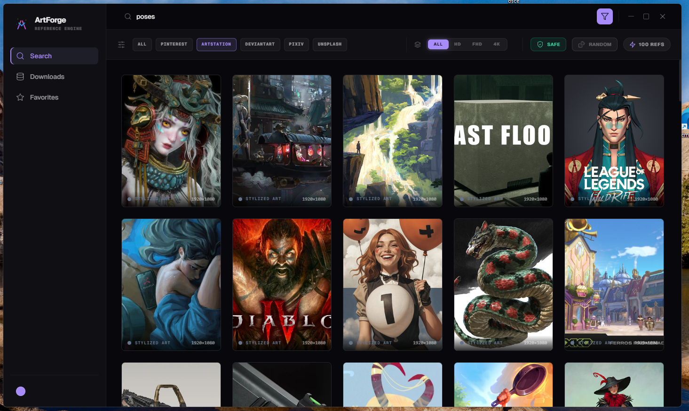
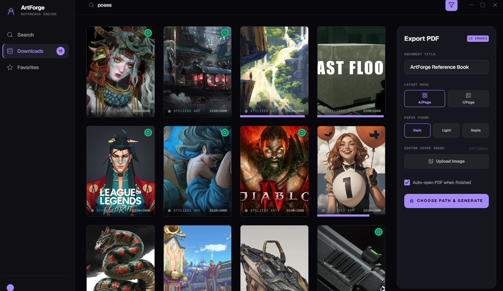
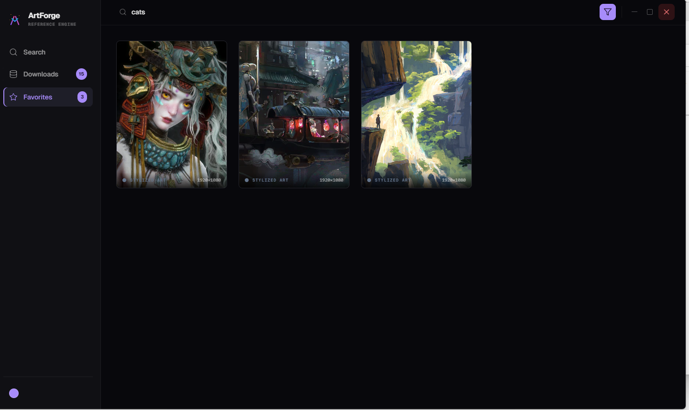
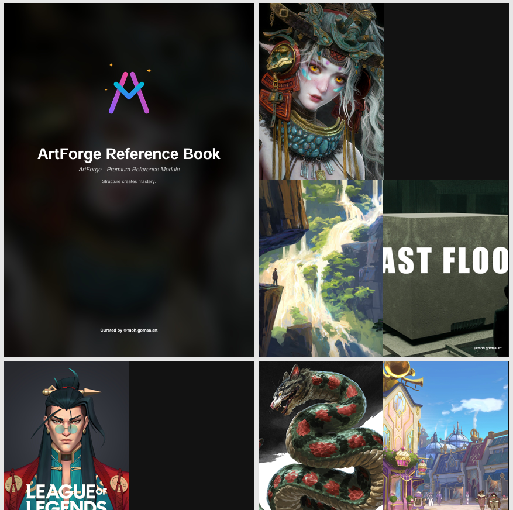
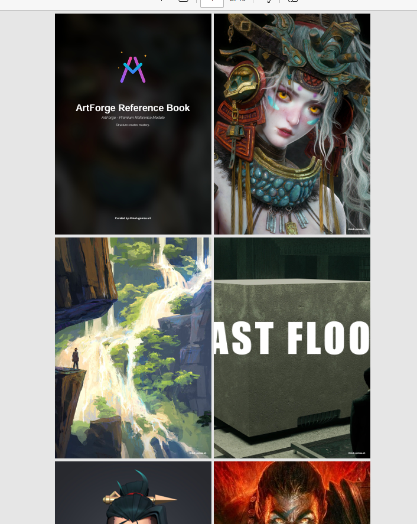

<div align="center">

<br/>


<br/><br/>

**The artist's reference engine — search, curate, and export in one dark workspace.**

<br/>


<br/>

</div>

---

<div align="center">

</div>

<br/>

<div align="center">

</div>

<br/>

<div align="center">

</div>

<br/>

<div align="center">

</div>

<br/>

<div align="center">

</div>

---

## Download

<div align="center">

### [⬇ Download ArtForge.exe](../../releases/latest)

**Windows 10 / 11 · 64-bit · No install required**

</div>

---

## How to Use

**1 — Download**
Click the button above and save `ArtForge.exe` anywhere on your PC.

**2 — Run**
Double-click `ArtForge.exe`. No Python, no Node.js, no setup needed.

**3 — Search**
Type any subject — `figure drawing`, `gesture`, `portrait`, `anatomy` — pick your platform and quality, hit **Search**.

**4 — Select & Download**
Click images to select them. Use **Batch Download** to send them all to your Downloads library at once.

**5 — Export PDF**
Go to the **Downloads** tab, select the images you want, configure your layout and quality in the PDF panel, and hit **Generate PDF**.

---

## Features

**Search**
- Multi-platform: Danbooru, Pinterest, ArtStation, DeviantArt, Pixiv, Unsplash
- Quality filter: HD · FHD · 4K
- Result count: 10 → 100
- Grid and list view

**Selection**
- Click to select / deselect
- Select All / Clear All
- Batch download in one click

**Downloads Library**
- Persistent across sessions
- Remove individual or bulk
- Favorites collection

**PDF Export**
- Layout: Practice Sheet · Session · Strips · Contact Sheet
- Quality: Draft 150dpi · Print 300dpi · Max 600dpi
- Page size: A4 · Letter · Square
- Optional captions per image

---

## FAQ

**Is it free?**
Yes, completely free and open source.

**Does it need internet?**
Yes — to fetch images from the art platforms.

**Where are my downloads saved?**
Inside the app locally. Use the PDF export to save a file to your disk.

**Windows shows a warning when I open it?**
Click "More info" → "Run anyway". This happens because the exe is not code-signed yet.

**Can I run it on Mac or Linux?**
Not yet. Windows only for now.

---

## Contributing

Pull requests welcome.

```bash
git clone https://github.com/yourname/artforge.git
cd artforge

# Backend
cd backend && pip install -r requirements.txt
uvicorn app:app --reload

# Frontend
cd frontend && npm install && npm run dev
```

---

## License

MIT — free to use, modify, and distribute.

---

<div align="center">

*Built for artists who got tired of switching between 6 browser tabs to find reference.*

**ArtForge — Reference without the noise.**

</div>
